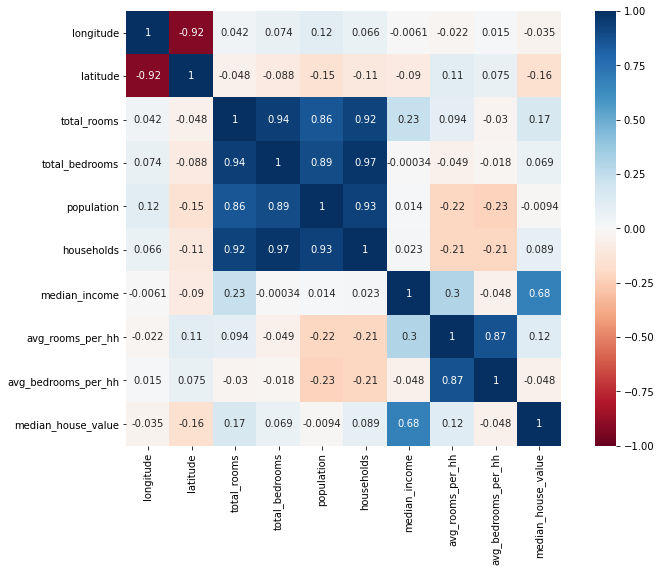

## Linear Regression Project: California Housing Prices

- Built a linear regression model to predict median house prices for California districts from the 1990 census data.
- Preprocessed data and handled missing values, inconsistent observations, and extracted new features.
- Visualized different relationships between features for better understanding of data.

_Python Version 3.8.5_  
Packages used include pandas, numpy, matplotlib, seaborn, sklearn.  
Dataset collected from [Cam Nugent on Kaggle](https://www.kaggle.com/datasets/camnugent/california-housing-prices?datasetId=5227&sortBy=voteCount).

__Data Cleaning__  
- Checked physical constraints between features (e.g. total number of bedrooms cannot be more than the total number of rooms)
- Verified consistent string formatting in applicable columns
- Made sure there were no duplicate observations
- Analyzed reason for and amount of missing values
- Extracted new features from existing features

__Exploratory Data Analysis__  
Conducted univariate and bivariate analyses across data.

__Model Building__  
In the end, our model demonstrated _R2_ = 0.648. While this might not be the most optimal model for our data, it was a great introduction to learning linear regression.
